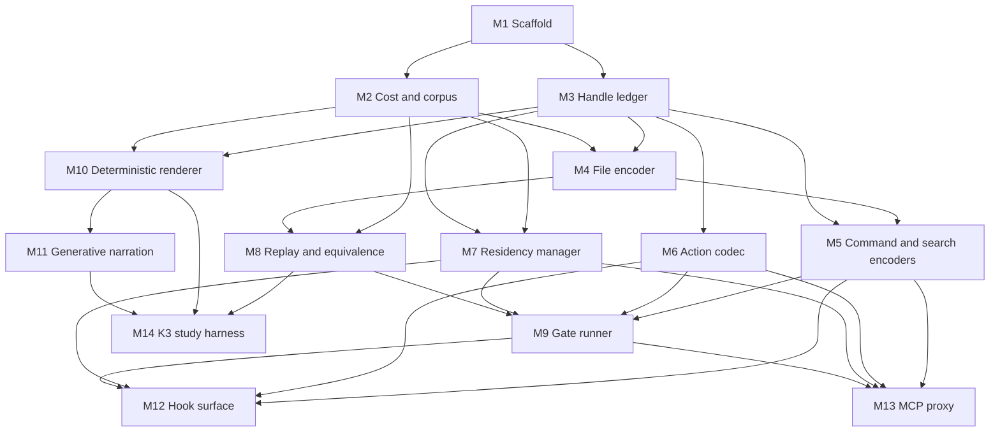
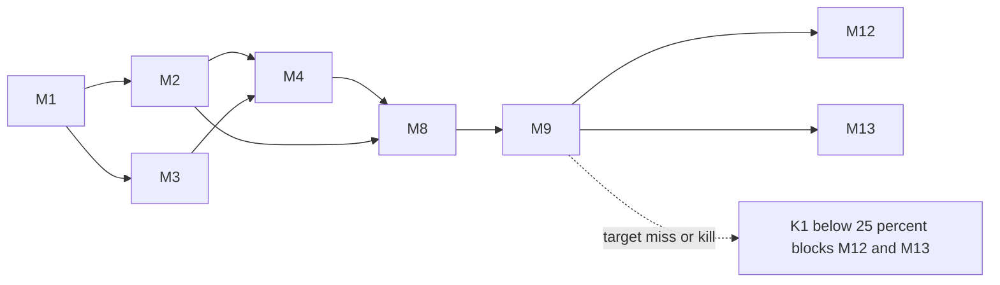

# Development Plan — Laconic

## 1. Context & Source Map

Laconic is a context-loop codec for coding agents: it re-encodes the observation and action channels at the tool boundary, keeps every elision recoverable, and renders prose for a human on demand. The repository is design-stage — three design documents, one measurement script, no package. This plan builds the system described in `docs/` from that starting point, ordering work so the evaluation harness exists before the integration surfaces that would depend on its verdicts.

| Plan section | Milestones | Source |
| --- | --- | --- |
| A — Foundation | M1, M2 | `docs/system-design.md` §7 (package structure), §8 (deployment); `docs/overview.md` §2.1 (measurement); this plan §2 (toolchain and commit assumptions) |
| B — Core codec | M3, M4, M5, M6, M7 | `docs/system-design.md` §2.1–2.4, §5.1 (ledger schema), §6 (non-functional); `docs/overview.md` §3.1–3.4, §4 (constraints) |
| C — Evaluation | M8, M9 | `docs/system-design.md` §2.6 (replay harness), §4 (gates); `docs/overview.md` §3.6, §6.3 |
| D — Human surface | M10, M11 | `docs/system-design.md` §2.5 (renderer); `docs/overview.md` §3.5, §8.2 (human-factor risk) |
| E — Integration | M12, M13 | `docs/system-design.md` §3.1 (hooks), §3.2 (MCP proxy), §6 (latency, fail-open) |
| F — Research | M14 | `docs/system-design.md` §4.1 (K3 protocol); `docs/overview.md` §7 (contribution C2) |
| Cross-cutting | §7 below | `docs/system-design.md` §6, §9; `docs/overview.md` §4, §8 |

## 2. Assumptions & Gaps

> ASSUMPTION: Python is 3.12+, per `docs/system-design.md` §8.1. M1 establishes `uv` + `ruff` + `mypy --strict` + `pytest` as this plan's toolchain; no `pyproject.toml` exists yet.

> ASSUMPTION: CI is GitHub Actions. The repository is hosted on GitHub and has no workflow directory today.

> ASSUMPTION: The evaluation corpus committed to the repository must be synthetic or redacted. The measurements in `docs/` were taken over real private session transcripts containing proprietary source; those cannot be committed. M2 defines the fixture format and a redaction path.

> GAP: No release, publication, or release-version policy is source-traceable. `docs/` contains no release version, `CHANGELOG.md`, tag scheme, or publish command, and the repository has none. M1 uses static PEP 621 metadata version `0.0.0` solely as an internal package-build identifier required for installation and `laconic --version`; it neither names a release nor establishes a versioning scheme. Keep that identifier fixed until a release policy is supplied. Do not introduce release-version, tag, publication, or changelog work until then.

> GAP: `docs/system-design.md` §2.2 specifies a tree-sitter outliner but names no grammar set or language-coverage target. M4 must either receive a coverage target or ship a documented minimum set plus the mandated fallback.

> GAP: `docs/system-design.md` §5.2 configures `judge_model` for semantic action-equivalence fallback but specifies no cost budget, sampling rate, or offline mode. K2 cannot run in CI without one. M8 must resolve this or gate the judge behind an explicit opt-in.

> GAP: `docs/system-design.md` §2.6 and §8.3 require a live model for replayed K2 and K5 actions, but CI must not depend on credentials, private corpus paths, nondeterministic responses, or uncapped spending. M8 must provide a committed provenance-tagged recorded-response replay mode as the CI default plus an explicit live mode that requires a configured model identifier and per-run cost cap. M9 must run recorded mode on PR and CI events and reject live mode there.

> GAP: K1's threshold (net ≥ 25%) is stated in `docs/overview.md` §6.3 without a committed baseline corpus to measure against. The threshold is only meaningful once M2 fixes the corpus; if the fixture corpus is unrepresentative, K1's number is not comparable to the figures in `docs/`.

## 3. Dependency Graph

## 4. Release Trains

| Target release | Included milestones | Preparation trigger | Required artifacts | Verification | Publication |
| --- | --- | --- | --- | --- | --- |
| `unversioned` | M1–M14 | All included milestones are externally merged. | `none` — see the release-policy `> GAP:` in §2 | `uv run ruff check . && uv run ruff format --check . && uv run mypy --strict src && uv run pytest -q && uv run laconic gates --corpus tests/corpus` | `not requested` |

## 5. Plan Evolution Protocol

- The committed root files `DEVELOPMENT_PLAN.md` and `EXECUTION_PROMPTS.md` are authoritative. The ignored `.docs/DEVELOPMENT_PLAN_HISTORY.md` ledger is reconstructible local evidence.
- Before each milestone, inspect its current plan/prompt, source map, current codebase, merged predecessor diffs, predecessor verification/CI evidence, and the local history when available.
- Record exactly one `DESIGN GO — PLAN REVISION: none`, `DESIGN GO — PLAN REVISION: <entry IDs>`, or `DESIGN NO-GO — REASON: <blocking evidence>`.
- A material mismatch updates the current milestone and every directly or transitively affected future milestone in both authoritative files. Recompute the dependency graph, critical path, and release-train membership when affected.
- `DESIGN NO-GO` blocks code, branches, and implementation PRs. A material plan revision requires a docs-only reconciliation PR that is reviewed, green, and externally merged before implementation.

- `Dependents` means the transitive closure of the dependency graph in §3. Recompute and mirror it into the corresponding prompt design gate whenever that graph changes.

**M1 bootstrap exception.** Before M1 PR-4 adds the first workflow, an M1 stack PR whose head lacks that workflow cannot have a successful GitHub Actions run. Its green-CI requirement instead means: no configured workflow or failed GitHub check run; the PR-specific local verification passes; and the fixed bootstrap artifact checks pass and are recorded in the PR: the plan/prompt structural harness from `plan-artifact-gate-verification`, plus the Mermaid 11 `mermaid.parse()` harness from `validate-mermaid-diagrams` over every diagram in `DEVELOPMENT_PLAN.md`. This exception covers the reconciliation PR and M1 PR-1 through PR-3. M1 PR-4 requires actual green CI; every later prerequisite requires actual green CI.

**Project-specific trigger.** This system's design is explicitly falsifiable: `docs/overview.md` §6.3 pre-registers five gates with kill conditions. A gate breach is a material mismatch by definition. A K1 result below 15% net after M9 invalidates M12–M13; K1 from 15% through less than 25% is a non-kill failed target that still blocks both until a docs-only reconciliation resolves the target miss.

## 6. Sections & Milestones

### Section A — Foundation

#### M1 — Repository scaffold and verification surface

| Field | Value |
| --- | --- |
| Objective | Establish the packaging, typing, lint, test, and CI surface every later milestone verifies against, plus an importable `laconic` package with a CLI entrypoint. |
| In / Out of scope | In: `pyproject.toml` with static internal build identifier `0.0.0`, `uv.lock`, ruff and mypy configuration, pytest layout, GitHub Actions workflow, `src/laconic/__init__.py`, `laconic` console script with `--version` and `--help`. Out: any codec, ledger, renderer, measurement behavior, release versioning, tags, publication, or changelog work. |
| Depends on | `none` |
| Target release | `unversioned` |
| Deliverables | Installable package skeleton; CI running lint, format check, strict type check, and tests on push and PR. |
| Acceptance | `uv sync` succeeds from a clean checkout. `laconic --version` emits the fixed internal build identifier and `laconic --help` exits 0 and lists no unimplemented verbs as available. `mypy --strict src` reports zero errors. CI is green on M1 PR-4. |
| Verification | `uv sync && uv run ruff check . && uv run ruff format --check . && uv run mypy --strict src && uv run pytest -q && uv run laconic --help && uv run laconic --version | grep -Fx 'laconic 0.0.0'` |
| Design reevaluation | Confirm the Python floor and M1 toolchain assumption in §2 remain compatible with `docs/system-design.md` §7–8. Dependents requiring review if this changes: M2, M3, M4, M5, M6, M7, M8, M9, M10, M11, M12, M13, M14. |
| Risks & rollback | Wrong Python floor or dependency resolution blocks every downstream milestone. Treating the internal build identifier as a release version would violate the release-policy gap. Stack is the rollback unit. |
| Est. PRs | 4 |

#### M2 — Cost accounting and corpus ingest

| Field | Value |
| --- | --- |
| Objective | Make the measurement in `docs/overview.md` §2 a first-class, tested package capability, and define the committed fixture-corpus format the evaluation harness will consume. |
| In / Out of scope | In: `costs.py` (pricing table, cache read/write multipliers, session-level accounting), `replay/corpus.py` (transcript ingest, redaction), `laconic measure`, migration of `scripts/measure_session_composition.py` into the package. Out: replay execution, gate evaluation, any encoding. |
| Depends on | M1 |
| Target release | `unversioned` |
| Deliverables | `laconic measure` reproducing the four-channel decomposition and cost split; a committed synthetic fixture corpus with a documented schema; the standalone script reduced to a thin shim. |
| Acceptance | Cost split for a known fixture sums to 100.00% within floating-point tolerance. Channel decomposition on the fixture matches a committed expected-values file exactly. Redaction removes source content while preserving channel sizes. `laconic measure` on an empty corpus exits non-zero with a clear message rather than dividing by zero. `uv run python scripts/measure_session_composition.py tests/corpus` produces output identical to `uv run laconic measure tests/corpus`. |
| Verification | `uv run pytest tests/test_costs.py tests/test_corpus.py -q && uv run laconic measure tests/corpus --expect tests/corpus/expected.json && uv run python scripts/measure_session_composition.py tests/corpus` |
| Design reevaluation | Confirm provider pricing and cache multipliers in `docs/system-design.md` §2.3 are current; confirm the fixture corpus is representative enough for K1 to be meaningful (see §2 `> GAP:`). Dependents: M4, M5, M7, M8, M9, M10, M11, M12, M13, M14. |
| Risks & rollback | An unrepresentative fixture corpus makes every later gate number uncomparable to `docs/`. Rollback is the stack. |
| Est. PRs | 4 |

### Section B — Core codec

#### M3 — Handle ledger and the recoverability invariant

| Field | Value |
| --- | --- |
| Objective | Provide the content-addressed store that makes every elision reversible, and prove the two invariants the whole system rests on: recoverability and deterministic encoding. |
| In / Out of scope | In: `ledger.py`, the `observations` and `compactions` SQLite schema from `docs/system-design.md` §5.1, handle minting, `expand` with span support, zstd raw storage, dedup by `(subject, content_sha)`, property-based invariant tests. Out: any encoder, residency policy, or rendering. |
| Depends on | M1 |
| Target release | `unversioned` |
| Deliverables | `Ledger` with `register`, `get`, `expand`; migration-safe schema; `tests/test_recoverability.py` and `tests/test_determinism.py`. |
| Acceptance | For arbitrary generated payloads, `expand(handle)` returns the exact registered bytes and `expand(handle:a-b)` returns exactly those lines. Registering byte-identical content under the same subject reuses the handle. Identical inputs in identical order produce identical handles and identical encodings across processes. Unknown handle raises rather than returning empty. |
| Verification | `uv run pytest tests/test_ledger.py tests/test_recoverability.py tests/test_determinism.py -q` |
| Design reevaluation | Confirm the schema in `docs/system-design.md` §5.1 is still the intended shape and that handle format remains model-typeable. Dependents: M4, M5, M6, M7, M8, M9, M10, M11, M12, M13, M14. |
| Risks & rollback | A recoverability hole is a silent correctness bug in every downstream encoder. Property-based tests are the mitigation; stack is the rollback unit. |
| Est. PRs | 4 |

#### M4 — File observation encoder

| Field | Value |
| --- | --- |
| Objective | Deliver the single largest lever: replace whole-file reads with a structural outline plus the requested span, recoverably. |
| In / Out of scope | In: `codec/outline.py` (tree-sitter outliner plus mandatory head/tail fallback), `codec/encoders/file.py`, span resolution, the never-elide-an-edit-target rule. Out: command, search, and fallback dispatch for other tools; residency; action encoding. |
| Depends on | M2, M3 |
| Target release | `unversioned` |
| Deliverables | File encoder wired to the ledger, with per-language outlining and a documented minimum grammar set resolving the §2 `> GAP:`. |
| Acceptance | On the fixture corpus, encoded read volume is materially below raw and every elided region is recoverable via `expand`. A file type with no available grammar degrades to head/tail span scoping and never raises. Encoding is deterministic for identical input. A region declared as an edit target is never elided. |
| Verification | `uv run pytest tests/test_encoders.py -q -k file && uv run laconic measure tests/corpus --codec on --report reduction` |
| Design reevaluation | Confirm the whale-read distribution in `docs/overview.md` §2.3 still motivates span scoping against the current corpus, and that no compensating-read effect is already visible. Dependents: M5, M8, M9, M12, M13, M14. |
| Risks & rollback | Span scoping may induce compensating follow-up reads that erase the saving — the primary risk named in `docs/overview.md` §8.1. M8 measures it; this milestone must not claim net savings. Rollback is the stack. |
| Est. PRs | 5 |
#### M5 — Command, search, and fallback encoders

| Field | Value |
| --- | --- |
| Objective | Cover the remaining observation shapes with error-salient elision, and provide a dispatch layer that always has a safe default. |
| In / Out of scope | In: `codec/encoders/command.py`, `codec/encoders/search.py`, `codec/encoders/fallback.py`, `codec/observe.py` dispatch, structured recognizers for test runners and build logs. Out: residency, action encoding, integration surfaces. |
| Depends on | M3, M4 |
| Target release | `unversioned` |
| Deliverables | Full observation-encoder set behind a name-dispatched interface with a fallback that handles any unrecognized tool. |
| Acceptance | Stderr, non-zero exit context, tracebacks, and failing assertions are never elided — enforced by property test. Every elided region emits a visible marker and an addressable handle. An unrecognized tool name encodes via fallback rather than raising. Duplicate-line collapse preserves original ordering of surviving lines. |
| Verification | `uv run pytest tests/test_encoders.py -q && uv run pytest tests/test_recoverability.py -q` |
| Design reevaluation | Confirm the three elision rules in `docs/system-design.md` §2.2 are unchanged and that measured Bash duplication has not shifted enough to reprioritize. Dependents: M9, M12, M13. |
| Risks & rollback | Over-aggressive elision of command output breaks debugging loops. Error-preservation property tests are the guard. |
| Est. PRs | 4 |

#### M6 — Action codec with symbol anchoring

| Field | Value |
| --- | --- |
| Objective | Re-express edits as deltas anchored to ledger handles and symbol names so they survive line drift from earlier edits in the same session. |
| In / Out of scope | In: `codec/act.py`, `AnchoredEdit`, `to_tool_input` materialization against current file state, occurrence disambiguation. Out: observation encoding, residency, surfaces. |
| Depends on | M3 |
| Target release | `unversioned` |
| Deliverables | Anchored-edit encoding and materialization with drift-resilience tests. |
| Acceptance | An anchored edit applies to the correct region after earlier edits have shifted line numbers. An ambiguous anchor with multiple occurrences resolves via explicit occurrence index or fails loudly rather than guessing. A stale anchor whose symbol no longer exists fails loudly. Round-tripping an edit through the codec produces a byte-identical result to the direct edit. |
| Verification | `uv run pytest tests/test_act.py -q` |
| Design reevaluation | Confirm the argument-volume distribution in `docs/system-design.md` §2.4 still justifies anchoring, and that the host agent's edit tool contract is unchanged. Dependents: M9, M12, M13. |
| Risks & rollback | A mis-anchored edit corrupts source. Fail-loud on ambiguity is mandatory; never apply a best-guess anchor. |
| Est. PRs | 3 |

#### M7 — Residency manager

| Field | Value |
| --- | --- |
| Objective | Manage what stays resident in the prefix, defaulting to append-only and permitting compaction only when the cache arithmetic proves it pays. |
| In / Out of scope | In: `residency.py`, `breakeven_turns`, append-only mode, opt-in compaction, `compactions` table writes including declined attempts with reasons, session-length estimation. Out: applying compaction inside a live agent session, which is M12. |
| Depends on | M2, M3 |
| Target release | `unversioned` |
| Deliverables | Residency policy engine with auditable accept and decline decisions. |
| Acceptance | `breakeven_turns` reproduces the table in `docs/system-design.md` §2.3 exactly for each listed pair. Compaction is declined and logged when projected turns are below break-even. Compaction is declined when no session-length estimate is available. Append-only mode never mutates an existing prefix entry — enforced by test. |
| Verification | `uv run pytest tests/test_residency.py -q` |
| Design reevaluation | Confirm published cache read/write multipliers are unchanged, since the entire break-even formula derives from them. Dependents: M9, M12, M13. |
| Risks & rollback | A wrong break-even decision converts the system into a cost increase — the failure mode `docs/system-design.md` §9.4 exists to prevent. Rollback is the stack. |
| Est. PRs | 4 |
| Human review gate | **HUMAN REVIEW GATE: Do not merge or run destructive paths unattended until a human reviews dry-run output, rollback notes, and audit/tombstone logging.** Compaction rewrites a cached prefix and can raise a real bill; every decision must be dry-runnable and logged before it is ever enabled by default. |

### Section C — Evaluation

#### M8 — Replay engine and action equivalence

| Field | Value |
| --- | --- |
| Objective | Measure the codec counterfactually against recorded sessions, reporting net cost including any follow-up reads the codec induces, and judge whether the agent behaves identically. |
| In / Out of scope | In: `replay/engine.py`, `replay/equivalence.py` (structural comparison first, opt-in model-judge fallback), net cost accounting, provenance-tagged recorded-response replay for CI, explicit cost-capped live replay, `laconic replay`. Out: threshold enforcement and pass/fail reporting, which is M9. |
| Depends on | M2, M4 |
| Target release | `unversioned` |
| Deliverables | Replay harness producing per-session net cost deltas and action-equivalence rates, with deterministic recorded-response replay for CI and explicit live replay for paid measurement and capture of provenance-tagged response artifacts. |
| Acceptance | Replaying with the codec disabled reproduces the recorded baseline cost within a stated tolerance. Reported savings are net of induced follow-up reads, and gross-only reporting is impossible through the public API. Structural equivalence is decided without a model. CI uses committed provenance-tagged recorded responses and cannot enter live mode. Live mode requires an explicit flag, configured model identifier, and per-run cost cap, and captures provenance-tagged response artifacts for later committed fixtures. The model judge is off by default and its sampling rate and budget are explicit, resolving the §2 `> GAP:`. |
| Verification | `uv run pytest tests/test_replay.py -q && uv run laconic replay tests/corpus --codec off --assert-baseline` |
| Design reevaluation | Confirm the corpus is still representative and that induced-read accounting matches the risk stated in `docs/overview.md` §8.1. Dependents: M9, M12, M13, M14. |
| Risks & rollback | A harness that reports gross savings would flatter the system and reproduce exactly the error this project was founded to correct. Live replay can add cost and nondeterminism; recorded CI replay and an explicit capped live mode are the mitigation. |
| Est. PRs | 5 |

#### M9 — Gate runner

| Field | Value |
| --- | --- |
| Objective | Turn the five pre-registered gates into an executable, CI-enforced verdict, so a kill condition is detected automatically rather than argued about. |
| In / Out of scope | In: `laconic gates` evaluating K1, K2, K4, K5 with the thresholds in `docs/overview.md` §6.3; the K5 exact-match reasoning benchmark harness and its committed provenance-tagged recorded responses captured through M8; CI wiring that uses M8 recorded-response replay only. Out: K3, which is human-subject and lands in M14; live replay on PR or CI events. |
| Depends on | M5, M6, M7, M8 |
| Target release | `unversioned` |
| Deliverables | Automated gate suite with machine-readable output and non-zero exit on a kill condition, including committed provenance-tagged K5 recorded responses. |
| Acceptance | Each of K1, K2, K4, K5 reports a value, its threshold, and pass/fail. A kill condition exits non-zero. A result below a target but above its kill condition remains a reported failure but exits zero; it blocks dependent milestones until reconciliation resolves the target miss. Thresholds are read from a single declared source, not duplicated per gate. K3 is reported as `manual — not evaluated` rather than silently omitted. K5 recorded responses are committed and provenance-tagged; K5 makes no model call in CI. CI runs the suite against `tests/corpus` using M8 recorded-response replay only. |
| Verification | `uv run laconic gates --corpus tests/corpus --format json && uv run pytest tests/test_gates.py -q` |
| Design reevaluation | Re-read `docs/overview.md` §6.3 thresholds. K1 below 15% invalidates M12 and M13. K1 from 15% through less than 25% is a non-kill failed target that blocks M12 and M13 until a docs-only reconciliation resolves the target miss. Dependents: M12, M13. |
| Risks & rollback | Gates that are green because they are weak are worse than no gates. Each gate needs a test proving it fails on a deliberately broken codec. CI must reject live replay so credential absence and model nondeterminism cannot make merge gates flaky. |
| Est. PRs | 4 |

### Section D — Human surface

#### M10 — Deterministic renderer

| Field | Value |
| --- | --- |
| Objective | Render a compact trace into prose from structural facts alone, with every claim traceable to the handle it came from and nothing hallucinable. |
| In / Out of scope | In: `render/templates.py`, `render/view.py`, `laconic view --turns A-B`, `laconic expand`. Out: any model-generated text, which is M11. |
| Depends on | M2, M3 |
| Target release | `unversioned` |
| Deliverables | Deterministic trace rendering plus the two human-facing CLI verbs. |
| Acceptance | Every rendered claim carries the handle it derives from. With `deterministic_only = true`, no model call is made — enforced by test. Rendering is byte-identical across runs for identical input. `laconic expand` resolves both bare and spanned handles. |
| Verification | `uv run pytest tests/test_render.py -q && uv run laconic view --turns 1-5 --corpus tests/corpus --deterministic-only` |
| Design reevaluation | Confirm the deterministic/generative split in `docs/system-design.md` §2.5 still bounds the placebic-explanation risk in `docs/overview.md` §8.2. Dependents: M11, M14. |
| Risks & rollback | A renderer that asserts facts without provenance recreates the hazard the split exists to avoid. |
| Est. PRs | 4 |
#### M11 — Generative narration

| Field | Value |
| --- | --- |
| Objective | Add optional local-model connective prose for genuinely generative gaps, visually separated from resolved facts and degrading cleanly when absent. |
| In / Out of scope | In: `render/narrate.py`, provider configuration, visual distinction of generated versus resolved spans. Out: any generated text entering the model's context or the deterministic fact layer. |
| Depends on | M10 |
| Target release | `unversioned` |
| Deliverables | Optional narration layer, off-path and non-blocking. |
| Acceptance | With `provider = "none"` or an unreachable provider, `laconic view` degrades to deterministic output and exits 0. Generated spans are visually distinguishable from resolved facts in output. Narration never mutates the ledger and never enters the agent's context — enforced by test. |
| Verification | `uv run pytest tests/test_narrate.py -q && uv run laconic view --turns 1-5 --corpus tests/corpus --provider none` |
| Design reevaluation | Confirm the human-factor risk framing in `docs/overview.md` §8.2 is unchanged and that K3 in M14 will measure this layer, not just the deterministic one. Dependents: M14. |
| Risks & rollback | Fluent narration that raises confidence without raising accuracy is the documented hazard; M14 measures it, this milestone must not claim it is absent. |
| Est. PRs | 3 |

### Section E — Integration

#### M12 — Surface A: hook integration

| Field | Value |
| --- | --- |
| Objective | Run the codec inside a real agent session through tool hooks, within a hard latency budget and failing open on any error. |
| In / Out of scope | In: `surfaces/hooks.py`, `laconic install`, `laconic status`, latency budget enforcement, fail-open path, live residency application. Out: MCP transport, which is M13. |
| Depends on | M5, M6, M7, M9 |
| Target release | `unversioned` |
| Deliverables | Installable hook integration with measured p99 encode latency. |
| Acceptance | p99 encode latency is under 40 ms on the fixture corpus. Exceeding the budget passes the raw result through unchanged. Any codec exception passes the raw result through unchanged — enforced by fault-injection test. `laconic install` is idempotent and reversible. `laconic status` reports ledger size, residency, and projected break-even. |
| Verification | `uv run pytest tests/test_hooks.py -q && uv run laconic status && uv run pytest tests/test_hooks.py -q -k latency` |
| Design reevaluation | Requires M9 K1 at or above the 25% target. A K1 below 15% invalidates this milestone; K1 from 15% through less than 25% requires a docs-only reconciliation before this milestone proceeds. Confirm the host hook event schema is unchanged. Dependents: `none`. |
| Risks & rollback | A codec on the critical path can stall or corrupt a live agent session. Fail-open and the latency budget are mandatory, not configurable defaults. |
| Est. PRs | 5 |
| Human review gate | **HUMAN REVIEW GATE: Do not merge or run destructive paths unattended until a human reviews dry-run output, rollback notes, and audit/tombstone logging.** This surface intercepts and replaces real tool results in a live session. |

#### M13 — Surface B: MCP proxy

| Field | Value |
| --- | --- |
| Objective | Make the codec available to any MCP-speaking client by wrapping an upstream server and re-encoding tool results in flight. |
| In / Out of scope | In: `surfaces/mcp_proxy.py`, unchanged `tools/list` passthrough, `tools/call` re-encoding, the `laconic_expand` tool registration. Out: hook-based integration, which is M12. |
| Depends on | M5, M6, M7, M9 |
| Target release | `unversioned` |
| Deliverables | Transport-agnostic MCP proxy exposing recovery to the model itself. |
| Acceptance | `tools/list` is forwarded byte-identically except for the added `laconic_expand` entry. A proxied `tools/call` returns encoded content whose elisions the model can recover through `laconic_expand`. Upstream errors propagate unchanged rather than being swallowed. Proxy failure falls back to passthrough. |
| Verification | `uv run pytest tests/test_mcp_proxy.py -q` |
| Design reevaluation | Requires M9 K1 at or above the 25% target. A K1 below 15% invalidates this milestone; K1 from 15% through less than 25% requires a docs-only reconciliation before this milestone proceeds. Confirm the MCP specification version targeted is current. Dependents: `none`. |
| Risks & rollback | A proxy that silently alters tool semantics breaks clients invisibly. Passthrough-on-failure and byte-identical `tools/list` are the guards. |
| Est. PRs | 4 |
| Human review gate | **HUMAN REVIEW GATE: Do not merge or run destructive paths unattended until a human reviews dry-run output, rollback notes, and audit/tombstone logging.** The proxy sits between a client and its real tool server. |

### Section F — Research

#### M14 — K3 human-study harness

| Field | Value |
| --- | --- |
| Objective | Build the instrumentation and materials for the study no published work has run: whether a developer reading a rendered compressed trace catches the same bugs as one reading the raw trace. |
| In / Out of scope | In: seeded-defect trace materials across the four defect classes, within-subjects counterbalanced condition assignment, capture of detection, time-to-decision, confidence, and the confidence-correctness calibration gap, pre-registered analysis script, and `laconic study`, which extends the §2.7 CLI surface solely for this K3 harness. Out: recruiting or running human participants, which is a manual gate outside this plan. |
| Depends on | M8, M10, M11 |
| Target release | `unversioned` |
| Deliverables | Analysis-ready study harness matching the protocol in `docs/system-design.md` §4.1. |
| Acceptance | A dry run with simulated responses produces an analysis-ready dataset. Condition order is randomized and counterbalanced — verified statistically over repeated seeds. All four defect classes are represented. The analysis script is committed before any real data is collected, and its equivalence margin is fixed in advance. |
| Verification | `uv run pytest tests/test_study.py -q && uv run laconic study dry-run --seed 0 --out /tmp/k3.json` |
| Design reevaluation | Confirm the protocol in `docs/system-design.md` §4.1 is unchanged and that M11's narration layer is included in the rendered condition. Dependents: `none`. |
| Risks & rollback | Analysis decisions made after seeing data would invalidate the contribution. Pre-committing the analysis script is the structural guard. |
| Est. PRs | 4 |
| Human review gate | **HUMAN REVIEW GATE: Do not merge or run destructive paths unattended until a human reviews dry-run output, rollback notes, and audit/tombstone logging.** This milestone additionally involves human participants; recruitment, consent, and data handling require human sign-off before any real session is run. |

## 7. Cross-Cutting Concerns

**Recoverability.** Every elision is addressable through the ledger. This is asserted by property-based tests in M3 and re-asserted by every encoder milestone. Source: `docs/overview.md` §4.

**Determinism.** A non-deterministic encoder changes the prefix each turn and converts a 0.10× cache read into a 1.25× cache write, inverting the entire cost thesis. `tests/test_determinism.py` is a release-blocking suite from M3 onward. Source: `docs/system-design.md` §6.

**Fail-open.** No codec path may block or break an agent. Enforced by fault-injection tests in M12 and M13. Source: `docs/system-design.md` §3.1, §6.

**Privacy.** The measurements in `docs/` derive from private transcripts. Committed fixtures must be synthetic or redacted; M2 owns the redaction path and no later milestone may commit raw session data.

**Honest measurement.** Net-of-induced-cost reporting is an API-level constraint in M8, not a reporting convention. Gross-only savings must be unrepresentable. Source: `docs/pitch.md` "what we are not claiming".

**Release management.** Deferred entirely — see the release-policy `> GAP:` in §2.

## 8. Critical Path

| Order | Milestone | Why it is on the path |
| --- | --- | --- |
| 1 | M1 | Nothing is verifiable without the toolchain surface |
| 2 | M2 + M3 | The corpus and ledger run in parallel; both must land before file encoding can be measured |
| 3 | M4 | The largest lever, now measured against M2's committed corpus |
| 4 | M8 | Establishes whether the codec saves anything net |
| 5 | M9 | Converts the gates into a verdict that authorizes or blocks integration |
| 6 | M12 | First real-session surface, gated on K1 |

M2 joins the critical path at M4 and gates the corpus-dependent file encoder, deterministic renderer, and replay harness. M5, M6, and M7 are required for M9 but can proceed in parallel with M4 and M8 once their prerequisites land. M10 leads to M11 and then M14; that human-study branch also requires M8 and does not block integration.
