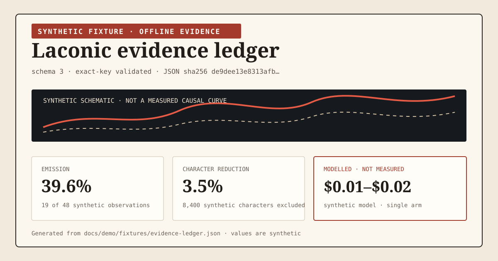

# Offline evidence dashboard demo

This directory contains a generated **synthetic fixture**, not production evidence. It demonstrates the self-contained HTML written by `laconic savings` without publishing any local session or ledger value.

[Open the generated HTML dashboard](spend-composition.html).



## Provenance

Every artifact derives from [`fixtures/evidence-ledger.json`](fixtures/evidence-ledger.json):

- `spend-composition.json` is the canonical, exact-key-validated semantic source;
- `spend-composition.md` and `spend-composition.html` embed that JSON's SHA-256 digest;
- `dashboard-preview.svg` carries the same digest and `modelled_not_measured` basis for the README preview.

The fixture uses invented counters, a synthetic provider, and a synthetic session identity. The generated public artifacts contain only aggregate report fields; the raw fixture session identity is hashed before serialization.

Regenerate and verify from the repository root:

```bash
uv run python scripts/generate_dashboard_demo.py
uv run python scripts/verify_dashboard_demo.py
```

The generator refuses fixture inputs outside `docs/demo/fixtures/`. The verifier performs two byte-identical generations, compares every committed artifact, validates the report's exact schema, checks the visible synthetic marker and claim boundary, rejects forbidden claims and private path markers, confirms the canonical digest across formats, and exercises the fixture-root guard.
