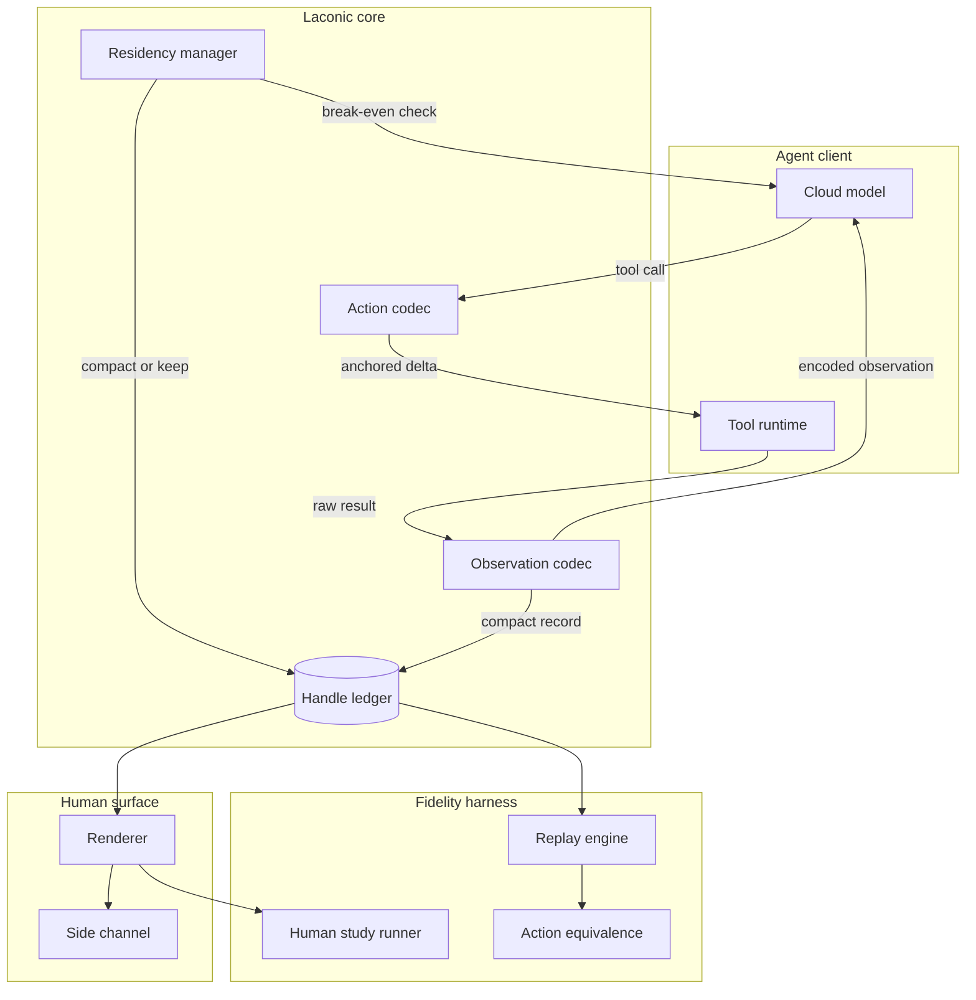
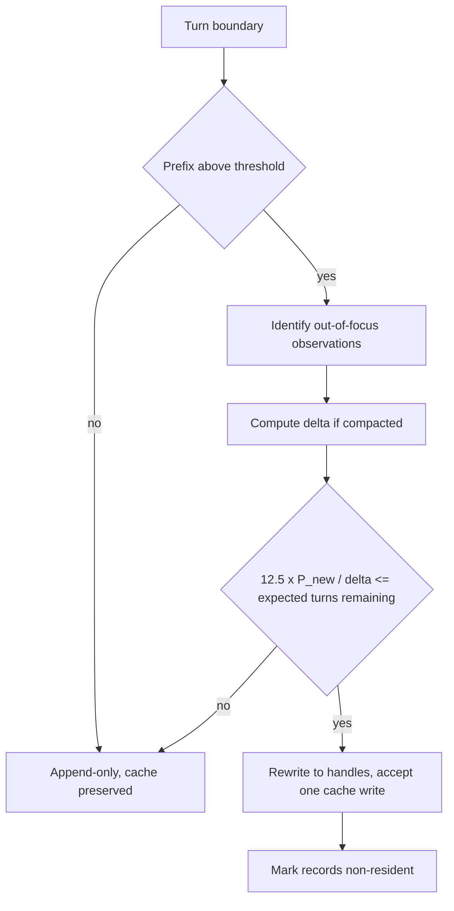
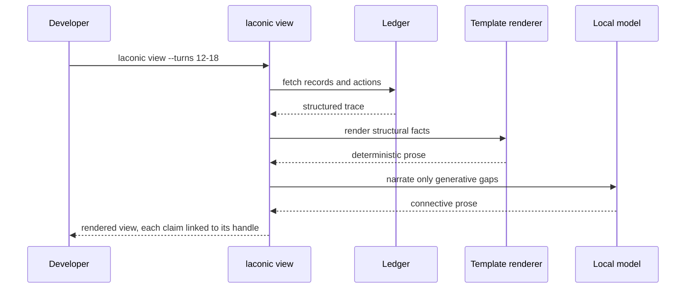
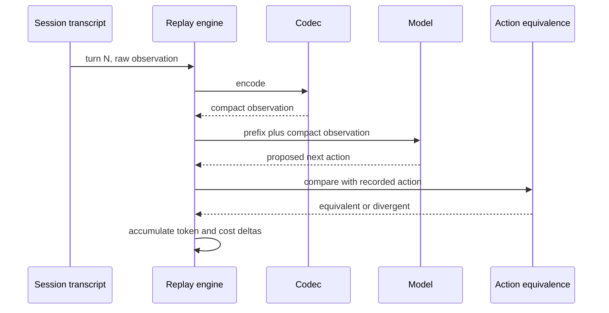
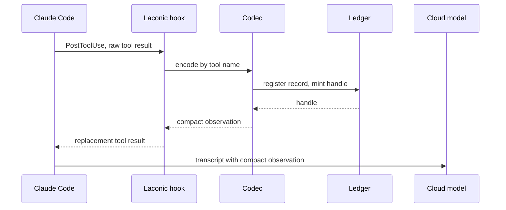

# Laconic: System Design

## 1. Architecture Overview

Laconic sits at the **tool boundary** of a coding agent. Everything an agent perceives passes through the observation codec on the way in; everything it does passes through the action codec on the way out. Both are backed by a content-addressed handle ledger that makes every elision reversible.

The model is never asked to write in a constrained schema while reasoning. The codec operates on transport, not on generation. This is deliberate — see §9.3.



Two deployment surfaces share the core:

- **Surface A — Claude Code / hook-based clients.** Hooks intercept tool results before they enter the transcript.
- **Surface B — MCP proxy.** Laconic wraps an MCP server and re-encodes tool results in flight, for any MCP-speaking client.

---

## 2. Component Design

### 2.1 Handle ledger (`src/laconic/ledger.py`)

The ledger is the single source of truth for everything the codec has elided. It is the mechanism that upholds the design's central invariant: **compression is lossy in presentation, lossless in reach.**

```python
from __future__ import annotations

import hashlib
import sqlite3
import time
from dataclasses import dataclass
from enum import StrEnum
from pathlib import Path


class ObservationKind(StrEnum):
    FILE = "F"
    COMMAND = "B"
    SEARCH = "S"
    FETCH = "W"
    OTHER = "X"


@dataclass(frozen=True, slots=True)
class Record:
    """One observation, stored whole, surfaced partially."""

    handle: str  # "F3" — short, stable, human-typeable
    kind: ObservationKind
    subject: str  # file path, command line, query
    content_sha: str  # sha256 of the raw content, first 16 hex chars
    raw: str  # full original payload, never shown in full unless asked
    encoded: str  # what the model actually saw
    created_at: float
    turn: int
    resident: bool  # still carried in the model's prefix


class Ledger:
    """Content-addressed store of observations, one per session."""

    def __init__(self, db_path: Path, session_id: str) -> None:
        self._db = sqlite3.connect(db_path)
        self._session = session_id
        self._counters: dict[ObservationKind, int] = {}
        self._init_schema()

    def register(
        self,
        kind: ObservationKind,
        subject: str,
        raw: str,
        encoded: str,
        turn: int,
    ) -> Record:
        """Store an observation and mint a handle.

        A re-observation of byte-identical content under the same subject
        reuses the existing handle rather than minting a new one. This is a
        cheap correctness win, not a headline saving: measured redundancy is
        0.5% of read volume.
        """
        sha = hashlib.sha256(raw.encode("utf-8", "replace")).hexdigest()[:16]
        if (existing := self._find(subject, sha)) is not None:
            return existing

        self._counters[kind] = self._counters.get(kind, 0) + 1
        handle = f"{kind.value}{self._counters[kind]}"
        record = Record(
            handle=handle,
            kind=kind,
            subject=subject,
            content_sha=sha,
            raw=raw,
            encoded=encoded,
            created_at=time.time(),
            turn=turn,
            resident=True,
        )
        self._insert(record)
        return record

    def expand(self, ref: str) -> str:
        """Resolve `F3` or `F3:61-94` back to raw content.

        This is the escape hatch that makes every elision safe. It is exposed
        to the model as a tool and to the human as a CLI verb.
        """
        handle, _, span = ref.partition(":")
        record = self.get(handle)
        if record is None:
            raise KeyError(f"unknown handle: {handle}")
        if not span:
            return record.raw
        start, _, end = span.partition("-")
        lines = record.raw.splitlines()
        return "\n".join(lines[int(start) - 1 : int(end)])
```

Handles are short (`F3`, `B7`, `S2`) because the model has to write them, and stable for the life of a session because the transcript refers back to them.

### 2.2 Observation codec (`src/laconic/codec/observe.py`)

Attacks 63.24% of context volume and ~38.1% of spend. One encoder per tool shape, dispatched by tool name, with a safe fallback.

```python
from __future__ import annotations

from typing import Protocol


class Encoder(Protocol):
    """Re-encode one raw tool result into a compact observation."""

    def encode(self, subject: str, raw: str, request: dict[str, object]) -> str: ...


class FileEncoder:
    """Structural outline plus the requested span.

    Rationale: reads are whale-distributed. Measured over 1,892 real reads,
    the largest 7% carry 38.7% of all read volume and the top 10% carry 47.3%.
    Returning a whole file to answer a question about one function pays for
    that file on every subsequent turn.
    """

    def __init__(self, outliner: Outliner, span_budget: int = 120) -> None:
        self._outliner = outliner
        self._span_budget = span_budget

    def encode(self, subject: str, raw: str, request: dict[str, object]) -> str:
        lines = raw.splitlines()
        outline = self._outliner.outline(subject, raw)
        span = self._resolve_span(request, outline, len(lines))

        head = f"{subject}  {len(lines):,} lines"
        if outline.symbols:
            head += f"\n  outline: {outline.render(limit=8)}"
        if span is None:
            return head  # outline alone answers the request
        start, end = span
        body = "\n".join(lines[start - 1 : end])
        return f"{head}\n  span {start}-{end}:\n{_indent(body)}"
```

`Outliner` is a tree-sitter-backed symbol extractor with a hard fallback: when no grammar is available for a file type, it degrades to head/tail span scoping rather than failing. A codec that errors on an unfamiliar language is worse than one that compresses it badly.

```python
class CommandEncoder:
    """Error-salient encoding of command output.

    Rationale: Bash is the second-largest channel — 5,708 calls, 6,309,732
    characters, mean 1,105. Exactly-duplicated lines account for only 4.2%,
    so this is elision of stable middles, not deduplication.
    """

    def encode(self, subject: str, raw: str, request: dict[str, object]) -> str:
        if (structured := self._recognize(subject, raw)) is not None:
            return structured  # test runners, installers, build logs

        lines = raw.splitlines()
        if len(lines) <= self._keep_head + self._keep_tail:
            return raw

        head = lines[: self._keep_head]
        tail = lines[-self._keep_tail :]
        elided = len(lines) - len(head) - len(tail)
        errors = [ln for ln in lines[self._keep_head : -self._keep_tail]
                  if self._looks_like_error(ln)]

        parts = [*head]
        if errors:
            parts.append(f"  [{len(errors)} error lines from elided region]")
            parts.extend(f"  {e}" for e in errors[: self._max_errors])
        parts.append(f"  [... {elided} lines elided — expand with the handle]")
        parts.extend(tail)
        return "\n".join(parts)
```

Every encoder obeys three rules:

1. **Never elide an error.** Stderr, non-zero exits, tracebacks, and failing assertions always survive verbatim.
2. **Never elide silently.** Every removed region leaves a visible marker and an addressable handle.
3. **Never elide code the model is about to edit.** The action codec declares its anchors; the observation codec respects them.

### 2.3 Residency manager (`src/laconic/residency.py`)

Attacks the 60.3% of spend that is cache reads. This component exists because the naive move — rewriting history to shrink it — can cost more than it saves.



The arithmetic is not a heuristic. Anthropic's cache bills writes at 1.25× input price and reads at 0.10×. Compacting a prefix from `P_old` to `P_new`, with `Δ = P_old − P_new`, costs one write of `P_new` and saves `0.10 × Δ` per subsequent turn:

```python
CACHE_WRITE_MULTIPLIER = 1.25
CACHE_READ_MULTIPLIER = 0.10


def breakeven_turns(prefix_after: int, delta: int) -> float:
    """Turns of continued session needed before compaction pays for itself.

    Reduces to 12.5 * prefix_after / delta at current cache pricing.
    """
    if delta <= 0:
        return float("inf")
    write_cost = CACHE_WRITE_MULTIPLIER * prefix_after
    saving_per_turn = CACHE_READ_MULTIPLIER * delta
    return write_cost / saving_per_turn
```

| `P_new` | `Δ` | Break-even |
|---:|---:|---:|
| 40,000 | 60,000 | 8.3 turns |
| 60,000 | 40,000 | 18.8 turns |
| 80,000 | 20,000 | 50.0 turns |

**Default is append-only.** Compaction is opt-in, and Laconic declines it when the projected session length is below break-even. Session length is estimated from the running turn count and the observed distribution of session lengths in the local corpus; when the estimate is unavailable, Laconic does not compact.

### 2.4 Action codec (`src/laconic/codec/act.py`)

Attacks 24.98% of context volume. Measured argument volume shows where it goes:

| Tool | Arg chars | Calls | Mean |
|---|---:|---:|---:|
| Write | 1,991,201 | 354 | 5,624 |
| Edit | 1,755,266 | 1,218 | 1,441 |
| Bash | 1,736,926 | 5,708 | 304 |

Edits are re-expressed as patches anchored to ledger handles and symbol names rather than to restated file content:

```python
@dataclass(frozen=True, slots=True)
class AnchoredEdit:
    handle: str          # "F3"
    anchor: str          # "check_token" — symbol, not line number
    anchor_occurrence: int
    replacement: str

    def to_tool_input(self, ledger: Ledger) -> dict[str, object]:
        """Materialize a real edit against the current file state.

        Symbol anchors survive line drift from earlier edits in the same
        session, which literal line-number anchors do not.
        """
```

Anchoring on symbols rather than line numbers is a correctness feature before it is a compression feature: in a session that edits a file repeatedly, line numbers go stale and symbol names usually do not.

### 2.5 Renderer (`src/laconic/render/`)

The compact trace is not meant to be read raw. The renderer resolves it into prose on demand, out of band, never blocking the agent and never feeding back into the model's context.



The split matters. **Structural facts render deterministically and are therefore not hallucinable**: which files were read, which spans, what changed, what a command returned, which test failed. Only genuinely generative connective text touches a model.

This is a direct response to a known hazard rather than a stylistic choice. Fluent explanations raise acceptance of AI output independent of its correctness (arXiv:2006.14779) and can produce an illusion of explanatory depth (arXiv:2102.02437). A free-running paraphrase of a compact trace is exactly that artifact. So:

- Generated text is visually distinguished from resolved facts.
- Every rendered claim carries the handle it came from.
- The raw trace is one keystroke away.
- K3 (§4) measures whether any of this actually helps a human catch bugs, rather than assuming it.

### 2.6 Replay harness (`src/laconic/replay/`)

The evaluation engine, and the reason the gates in §4 are checkable rather than aspirational. It reads real session transcripts, re-runs the tool loop with the codec inserted, and reports counterfactual cost and behaviour.



Action equivalence is judged structurally first — same tool, same target, same anchor — and only falls back to a model judge for semantic near-misses, with the judge's verdicts sampled and hand-audited. The harness reports **net** cost including any follow-up reads the codec induces, because gross bytes removed is the number that would flatter us.

### 2.7 CLI (`src/laconic/cli.py`)

```
laconic install                 register hooks or MCP proxy
laconic measure [PATH ...]      channel decomposition of real sessions
laconic replay [--codec on|off] counterfactual cost and action equivalence
laconic view --turns A-B        rendered human view of a trace
laconic expand F3[:61-94]       resolve a handle to raw content
laconic status                  ledger size, residency, projected break-even
laconic gates                   run K1, K2, K4, K5 and print pass/fail
```

`laconic measure` is deliberately the first verb a user runs. If someone's own sessions show a different channel decomposition than ours, we want them to find that out before installing anything.

---

## 3. Integration

### 3.1 Surface A — hook-based clients



The hook is synchronous and on the critical path, which imposes a hard latency budget (§6). If the codec cannot encode within budget, it passes the raw result through unchanged. **Failing open is mandatory**: a codec that stalls the agent is worse than no codec.

### 3.2 Surface B — MCP proxy

Laconic wraps an upstream MCP server, forwards `tools/list` unchanged, and re-encodes `tools/call` results in flight. It registers one additional tool, `laconic_expand`, so the model can recover any elided region itself.

This surface makes the codec available to any MCP-speaking client, and it is the reason the ledger is transport-agnostic: neither MCP nor A2A specifies payload content style, which is precisely the layer Laconic occupies.

---

## 4. Gates

Pre-registered before implementation. `laconic gates` runs the automatable ones in CI against a committed transcript corpus.

| # | Gate | Threshold | Kill condition | Automated |
|---|---|---|---|---|
| K1 | Net session cost reduction on replayed real traces, including induced follow-up reads | ≥ 25% | < 15% | yes |
| K2 | Action equivalence, compressed vs raw observation | ≥ 95% | < 90% | yes |
| K3 | Human bug-catch rate, rendered view vs raw trace | within 5pp | worse by > 10pp | no |
| K4 | Codec overhead in added input tokens per turn | < 500 | above | yes |
| K5 | Exact-match reasoning benchmark, codec on vs off | within 2pp | beyond | yes |

### 4.1 K3 protocol

The experiment nobody in the literature has run, so the protocol is stated in full rather than deferred.

- **Design.** Within-subjects, counterbalanced. Each participant reviews agent traces in both conditions — rendered view and raw trace — on matched task pairs, with condition order randomised.
- **Materials.** Real agent traces from the corpus, each containing exactly one seeded defect of a known class: an unhandled error path, an incorrect boundary condition, a silently swallowed exception, or an edit applied to the wrong target.
- **Primary measure.** Defect detection rate.
- **Secondary measures.** Time to decision, self-reported confidence, and the calibration gap between confidence and correctness — the last of these is where the placebic-explanation hazard would show up first.
- **Analysis.** Pre-registered; paired comparison with the equivalence margin stated in advance rather than chosen after seeing the data.
- **Publication.** The result is published whichever way it lands. A negative K3 is a finding about every compression tool in this space, including Caveman's and including Laconic v1's, and it is worth more to the field than a positive one is to us.

---

## 5. Data Model

### 5.1 Ledger schema

```sql
CREATE TABLE observations (
    session_id   TEXT    NOT NULL,
    handle       TEXT    NOT NULL,
    kind         TEXT    NOT NULL,   -- F | B | S | W | X
    subject      TEXT    NOT NULL,   -- path, command, query
    content_sha  TEXT    NOT NULL,
    raw          BLOB    NOT NULL,   -- full payload, zstd
    encoded      TEXT    NOT NULL,   -- what the model saw
    raw_chars    INTEGER NOT NULL,
    encoded_chars INTEGER NOT NULL,
    turn         INTEGER NOT NULL,
    resident     INTEGER NOT NULL DEFAULT 1,
    created_at   REAL    NOT NULL,
    PRIMARY KEY (session_id, handle)
);

CREATE INDEX obs_dedup ON observations (session_id, subject, content_sha);
CREATE INDEX obs_resident ON observations (session_id, resident, turn);

CREATE TABLE compactions (
    session_id     TEXT    NOT NULL,
    turn           INTEGER NOT NULL,
    prefix_before  INTEGER NOT NULL,
    prefix_after   INTEGER NOT NULL,
    breakeven_turns REAL   NOT NULL,
    applied        INTEGER NOT NULL,  -- 0 when declined as not worth it
    PRIMARY KEY (session_id, turn)
);
```

`raw_chars` and `encoded_chars` are stored per record so `laconic status` can report realised compression per tool without re-deriving it, and so a declined compaction leaves an auditable row explaining why.

### 5.2 Configuration (`~/.laconic/config.toml`)

```toml
[laconic]
enabled = true
fail_open = true                  # pass raw through on codec error or timeout

[observe]
encode_latency_budget_ms = 40     # hard cap; exceeded means pass-through
span_budget_lines = 120           # default span returned around a match
outline_symbol_limit = 8
preserve_errors = true            # never elide stderr or tracebacks

[observe.command]
keep_head_lines = 20
keep_tail_lines = 20
max_surfaced_errors = 25

[residency]
mode = "append_only"              # "append_only" | "compact"
compact_above_tokens = 120000
min_projected_turns = 0           # 0 means require a real estimate

[act]
anchor = "symbol"                 # "symbol" | "line"

[render]
provider = "ollama"               # "ollama" | "none"
model = "gemma:latest"
deterministic_only = false        # true renders structural facts and nothing else

[replay]
corpus = "~/.laconic/corpus"
judge_model = "claude-sonnet-4-6" # semantic fallback for action equivalence
```

`fail_open` and `encode_latency_budget_ms` are the two settings that keep the codec from becoming the problem it is trying to solve.

---

## 6. Non-Functional Requirements

| Property | Requirement | Rationale |
|---|---|---|
| Encode latency | p99 < 40 ms per observation | On the critical path via the hook |
| Failure mode | Pass raw content through | A codec that blocks the agent is a regression |
| Recoverability | 100% of elided content addressable | Central design invariant, verified by K2 |
| Ledger growth | Bounded per session, zstd-compressed raw | Sessions carry 20 MB+ of raw observations |
| Renderer | Fully out of band | Must never influence the model or block a turn |
| Determinism | Same input, same encoding | Otherwise the prompt cache is destroyed |

The determinism requirement is easy to overlook and expensive to violate: a non-deterministic encoder changes the prefix on every turn and turns a 0.10× cache read into a 1.25× cache write, converting the entire system into a cost increase.

---

## 7. Package Structure

```
laconic/
├── pyproject.toml
├── README.md
├── LICENSE
├── src/
│   └── laconic/
│       ├── __init__.py
│       ├── cli.py
│       ├── ledger.py                # handle ledger, expansion
│       ├── residency.py             # break-even arithmetic, compaction
│       ├── costs.py                 # pricing constants, session-level accounting
│       ├── codec/
│       │   ├── observe.py           # encoder dispatch
│       │   ├── encoders/
│       │   │   ├── file.py          # outline plus span
│       │   │   ├── command.py       # error-salient elision
│       │   │   ├── search.py        # path interning
│       │   │   └── fallback.py      # head/tail, always available
│       │   ├── outline.py           # tree-sitter symbol extraction
│       │   └── act.py               # anchored edits
│       ├── render/
│       │   ├── templates.py         # deterministic structural rendering
│       │   ├── narrate.py           # local-model connective prose
│       │   └── view.py              # trace assembly
│       ├── replay/
│       │   ├── engine.py            # counterfactual replay
│       │   ├── equivalence.py       # K2 action equivalence
│       │   └── corpus.py            # transcript ingest
│       ├── surfaces/
│       │   ├── hooks.py             # Surface A
│       │   └── mcp_proxy.py         # Surface B
│       └── prompts/
│           └── narrate.txt
├── scripts/
│   └── measure_session_composition.py
├── tests/
│   ├── test_ledger.py
│   ├── test_encoders.py
│   ├── test_residency.py            # break-even arithmetic
│   ├── test_recoverability.py       # the invariant, property-based
│   ├── test_determinism.py          # same input, same encoding
│   ├── test_replay.py
│   └── corpus/
└── docs/
    ├── overview.md
    ├── pitch.md
    └── system-design.md
```

`test_recoverability.py` and `test_determinism.py` are the two suites that must never be allowed to go yellow. The first guards correctness, the second guards the entire cost thesis.

---

## 8. Deployment Requirements

### 8.1 Codec only

| Requirement | Minimum |
|---|---|
| Python | 3.12+ |
| Claude Code or an MCP-speaking client | current stable |
| Disk for the ledger | ~50 MB per heavy session, zstd-compressed |
| Network | none — the codec is entirely local |

### 8.2 With rendering

| Requirement | Minimum | Notes |
|---|---|---|
| Ollama or compatible | 0.5+ | Only for generative connective text |
| Local model | any 7–8B instruct | Structural facts never touch it |
| RAM | 8 GB free | |

Rendering is optional and out of band. With `deterministic_only = true` the renderer needs no model at all — structural facts alone cover most of what a human wants from a trace, and they cannot be hallucinated.

### 8.3 For evaluation

| Requirement | Notes |
|---|---|
| Transcript corpus | The replay harness needs real sessions; `laconic measure` ingests them |
| API key | Replay re-runs turns against a live model for K2 and K5 |
| Participants | K3 only, per the protocol in §4.1 |

---

## 9. Design Decisions

### 9.1 Why a codec instead of an output-style prompt

Measured over 19,818 real assistant turns, human-facing prose is 6.47% of context volume and 2.30% of spend, while tool results are 63.24% of volume and roughly 38.1% of spend. An output-style prompt cannot reach the larger channel. See `docs/overview.md` §2 for the full decomposition.

### 9.2 Why residency instead of deduplication

We tested deduplication first because it was the obvious answer, and it failed: byte-identical re-reads are 0.5% of read volume and duplicate Bash lines 4.2%. Agents do not repeat themselves — they over-fetch once and then carry the result forever. Dedup stays in the ledger because it is nearly free, but it is not the mechanism.

### 9.3 Why the codec never constrains generation

Prompt-level format instructions are the dominant source of format-induced accuracy loss, exceeding constrained decoding's sampling bias (*The Format Tax*, arXiv:2604.03616), and the penalty scales inversely with a model's spare capacity (*Capacity, Not Format*, arXiv:2606.09410; *Let Me Speak Freely?*, arXiv:2408.02442). The prescribed remedy is to decouple reasoning from formatting.

Laconic applies that remedy structurally: encoding happens at the transport boundary, before an observation reaches the model and after an action leaves it. The model reasons freely in whatever register it likes. K5 verifies this holds on our stack rather than trusting the argument.

### 9.4 Why compaction is opt-in

Because rewriting a cached prefix costs a full cache write, and a tool that quietly busts your cache to shrink your context raises your bill while reporting a saving. The break-even formula in §2.3 is computed before every compaction, and declining is logged.

### 9.5 Why the human study is in scope

Nobody has measured whether compressed model output degrades a developer's ability to catch bugs. Verification is already a top-three time cost in AI-assisted programming (arXiv:2210.14306); explanations raise acceptance independent of correctness (arXiv:2006.14779) and reduce over-reliance only when they genuinely lower verification cost (arXiv:2212.06823).

Shipping a compression tool without that measurement is how a project ends up optimising a number while making its users worse at their job. K3 is the gate that makes the rest of the system honest.
