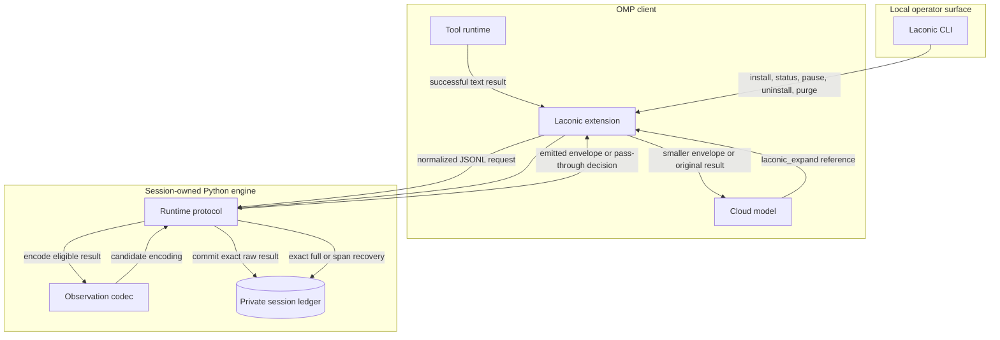
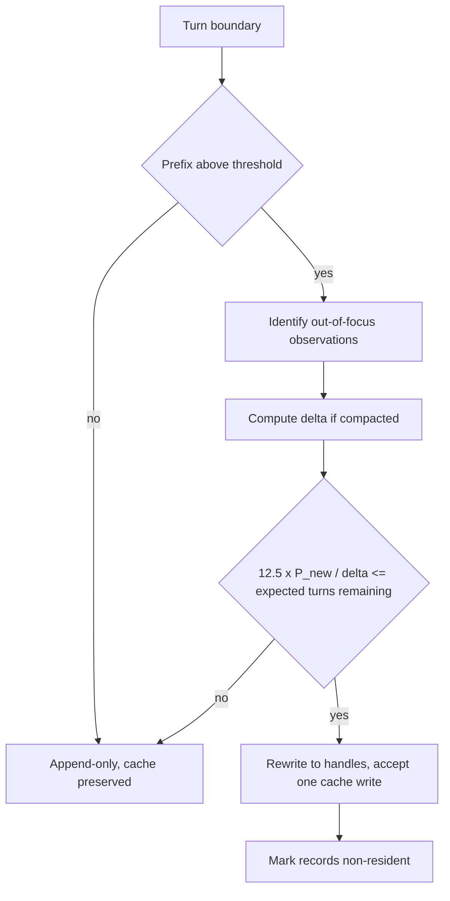
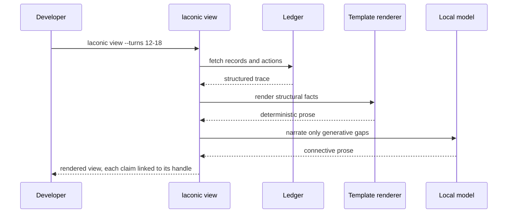
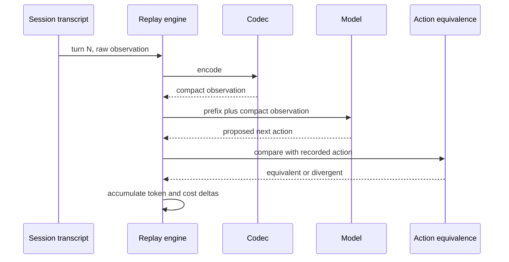
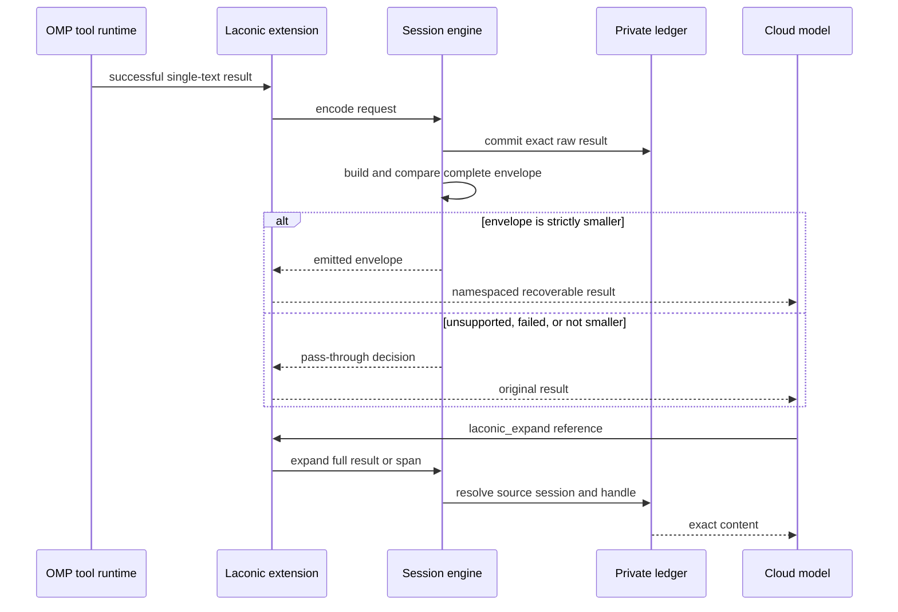

# Laconic: System Design

## 1. Architecture Overview

Laconic sits at the **tool-result boundary** of an existing coding agent. The first runtime product is an explicitly installed OMP extension backed by one session-owned Python engine. The host adapter owns the session-scoped engine process lifecycle and result mutation; the engine owns encoding, recovery, decisions, and local storage.

No live codec integration is released in version 0.8.0. The architecture below is the approved target for the OMP-first beta.



The first adapter transforms only successful, exactly-one-text-chunk results from OMP's `read`, `bash`, `grep`, and `glob` tools. Unsupported tools, mixed or non-text content, and errors pass through unchanged. A 250 ms deadline and a three-consecutive-failure circuit breaker preserve native OMP behavior when the engine fails.

The engine writes the exact raw observation before it may emit a replacement. It constructs the complete model-visible envelope, including the recovery reference, and emits only when that envelope is strictly smaller than the raw result. Internal handles such as `F3` remain short and session-scoped; model-visible references include the source OMP session, for example `<omp-session-id>/F3:61-94`.

Thin adapters share this canonical engine. OMP is first. Claude Code requires a separate post-beta adapter design. MCP, action rewriting, residency/history compaction, and hosted services are deferred.

---
## 2. Component Design

**Maturity boundary:** the codec, ledger, replay, renderer, action codec, and residency decision accounting exist in version 0.8.0. The session runtime, namespaced envelope, and OMP adapter described here are planned for the bounded beta. Action rewriting and applied residency compaction are not part of that beta.

### 2.1 Handle ledger (`src/laconic/ledger.py`)

The ledger is the single source of truth for everything the codec has elided. It is the mechanism that upholds the design's central invariant: **compression is lossy in presentation, lossless in reach.**

```python
from __future__ import annotations

import hashlib
import sqlite3
import time
from dataclasses import dataclass
from enum import StrEnum
from pathlib import Path


class ObservationKind(StrEnum):
    FILE = "F"
    COMMAND = "B"
    SEARCH = "S"
    FETCH = "W"
    OTHER = "X"


@dataclass(frozen=True, slots=True)
class Record:
    """One observation, stored whole, surfaced partially."""

    handle: str  # "F3" — short, stable, human-typeable
    kind: ObservationKind
    subject: str  # file path, command line, query
    content_sha: str  # sha256 of the raw content, first 16 hex chars
    raw: str  # full original payload, never shown in full unless asked
    encoded: str  # what the model actually saw
    created_at: float
    turn: int
    resident: bool  # still carried in the model's prefix


class Ledger:
    """Content-addressed store of observations, one per session."""

    def __init__(self, db_path: Path, session_id: str) -> None:
        self._db = sqlite3.connect(db_path)
        self._session = session_id
        self._counters: dict[ObservationKind, int] = {}
        self._init_schema()

    def register(
        self,
        kind: ObservationKind,
        subject: str,
        raw: str,
        encoded: str,
        turn: int,
    ) -> Record:
        """Store an observation and mint a handle.

        A re-observation of byte-identical content under the same subject
        reuses the existing handle rather than minting a new one. This is a
        cheap correctness win, not a headline saving: measured redundancy is
        0.5% of read volume.
        """
        sha = hashlib.sha256(raw.encode("utf-8", "replace")).hexdigest()[:16]
        if (existing := self._find(subject, sha)) is not None:
            return existing

        self._counters[kind] = self._counters.get(kind, 0) + 1
        handle = f"{kind.value}{self._counters[kind]}"
        record = Record(
            handle=handle,
            kind=kind,
            subject=subject,
            content_sha=sha,
            raw=raw,
            encoded=encoded,
            created_at=time.time(),
            turn=turn,
            resident=True,
        )
        self._insert(record)
        return record

    def expand(self, ref: str) -> str:
        """Resolve `F3` or `F3:61-94` back to raw content.

        This is the escape hatch that makes every elision safe. It is exposed
        to the model as a tool and to the human as a CLI verb.
        """
        handle, _, span = ref.partition(":")
        record = self.get(handle)
        if record is None:
            raise KeyError(f"unknown handle: {handle}")
        if not span:
            return record.raw
        start, _, end = span.partition("-")
        lines = record.raw.splitlines()
        return "\n".join(lines[int(start) - 1 : int(end)])
```

Handles remain short (`F3`, `B7`, `S2`) inside one ledger. A runtime envelope prefixes the handle with its source OMP session so references remain unambiguous after resume or full fork: `<omp-session-id>/F3[:first-last]`.

### 2.2 Observation codec (`src/laconic/codec/observe.py`)

Attacks 63.24% of context volume and ~38.1% of spend. One encoder per tool shape, dispatched by tool name, with a safe fallback.

```python
from __future__ import annotations

from typing import Protocol


class Encoder(Protocol):
    """Re-encode one raw tool result into a compact observation."""

    def encode(self, subject: str, raw: str, request: dict[str, object]) -> str: ...


class FileEncoder:
    """Structural outline plus the requested span.

    Rationale: reads are whale-distributed. Measured over 1,892 real reads,
    the largest 7% carry 38.7% of all read volume and the top 10% carry 47.3%.
    Returning a whole file to answer a question about one function pays for
    that file on every subsequent turn.
    """

    def __init__(self, outliner: Outliner, span_budget: int = 120) -> None:
        self._outliner = outliner
        self._span_budget = span_budget

    def encode(self, subject: str, raw: str, request: dict[str, object]) -> str:
        lines = raw.splitlines()
        outline = self._outliner.outline(subject, raw)
        span = self._resolve_span(request, outline, len(lines))

        head = f"{subject}  {len(lines):,} lines"
        if outline.symbols:
            head += f"\n  outline: {outline.render(limit=8)}"
        if span is None:
            return head  # outline alone answers the request
        start, end = span
        body = "\n".join(lines[start - 1 : end])
        return f"{head}\n  span {start}-{end}:\n{_indent(body)}"
```

`Outliner` is a tree-sitter-backed symbol extractor with a hard fallback for direct library use: when no grammar is available for a file type, it degrades to head/tail span scoping rather than failing. The first OMP runtime still uses an explicit tool allowlist and does not route unknown tools through the fallback encoder.

```python
class CommandEncoder:
    """Error-salient encoding of command output.

    Rationale: Bash is the second-largest channel — 5,708 calls, 6,309,732
    characters, mean 1,105. Exactly-duplicated lines account for only 4.2%,
    so this is elision of stable middles, not deduplication.
    """

    def encode(self, subject: str, raw: str, request: dict[str, object]) -> str:
        if (structured := self._recognize(subject, raw)) is not None:
            return structured  # test runners, installers, build logs

        lines = raw.splitlines()
        if len(lines) <= self._keep_head + self._keep_tail:
            return raw

        head = lines[: self._keep_head]
        tail = lines[-self._keep_tail :]
        elided = len(lines) - len(head) - len(tail)
        errors = [ln for ln in lines[self._keep_head : -self._keep_tail]
                  if self._looks_like_error(ln)]

        parts = [*head]
        if errors:
            parts.append(f"  [{len(errors)} error lines from elided region]")
            parts.extend(f"  {e}" for e in errors[: self._max_errors])
        parts.append(f"  [... {elided} lines elided — expand with the handle]")
        parts.extend(tail)
        return "\n".join(parts)
```

Every encoder obeys three rules:

1. **Never elide an error.** Stderr, non-zero exits, tracebacks, and failing assertions always survive verbatim.
2. **Never elide silently.** Every removed region leaves a visible marker and an addressable handle.
3. **Never elide code the model is about to edit.** The action codec declares its anchors; the observation codec respects them.

### 2.3 Residency manager (`src/laconic/residency.py`)

Attacks the 60.3% of spend that is cache reads. This component exists because the naive move — rewriting history to shrink it — can cost more than it saves.



The arithmetic is not a heuristic. Anthropic's cache bills writes at 1.25× input price and reads at 0.10×. Compacting a prefix from `P_old` to `P_new`, with `Δ = P_old − P_new`, costs one write of `P_new` and saves `0.10 × Δ` per subsequent turn:

```python
CACHE_WRITE_MULTIPLIER = 1.25
CACHE_READ_MULTIPLIER = 0.10


def breakeven_turns(prefix_after: int, delta: int) -> float:
    """Turns of continued session needed before compaction pays for itself.

    Reduces to 12.5 * prefix_after / delta at current cache pricing.
    """
    if delta <= 0:
        return float("inf")
    write_cost = CACHE_WRITE_MULTIPLIER * prefix_after
    saving_per_turn = CACHE_READ_MULTIPLIER * delta
    return write_cost / saving_per_turn
```

| `P_new` | `Δ` | Break-even |
|---:|---:|---:|
| 40,000 | 60,000 | 8.3 turns |
| 60,000 | 40,000 | 18.8 turns |
| 80,000 | 20,000 | 50.0 turns |

**Default is append-only.** Compaction is opt-in, and Laconic declines it when the projected session length is below break-even. Session length is estimated from the running turn count and the observed distribution of session lengths in the local corpus; when the estimate is unavailable, Laconic does not compact.

### 2.4 Action codec (`src/laconic/codec/act.py`)

Attacks 24.98% of context volume. Measured argument volume shows where it goes:

| Tool | Arg chars | Calls | Mean |
|---|---:|---:|---:|
| Write | 1,991,201 | 354 | 5,624 |
| Edit | 1,755,266 | 1,218 | 1,441 |
| Bash | 1,736,926 | 5,708 | 304 |

Edits are re-expressed as patches anchored to ledger handles and symbol names rather than to restated file content:

```python
@dataclass(frozen=True, slots=True)
class AnchoredEdit:
    handle: str          # "F3"
    anchor: str          # "check_token" — symbol, not line number
    anchor_occurrence: int
    replacement: str

    def to_tool_input(self, ledger: Ledger) -> dict[str, object]:
        """Materialize a real edit against the current file state.

        Symbol anchors survive line drift from earlier edits in the same
        session, which literal line-number anchors do not.
        """
```

Anchoring on symbols rather than line numbers is a correctness feature before it is a compression feature: in a session that edits a file repeatedly, line numbers go stale and symbol names usually do not.

### 2.5 Renderer (`src/laconic/render/`)

The compact trace is not meant to be read raw. The renderer resolves it into prose on demand, out of band, never blocking the agent and never feeding back into the model's context.



The split matters. **Structural facts render deterministically and are therefore not hallucinable**: which files were read, which spans, what changed, what a command returned, which test failed. Only genuinely generative connective text touches a model.

This is a direct response to a known hazard rather than a stylistic choice. Fluent explanations raise acceptance of AI output independent of its correctness (arXiv:2006.14779) and can produce an illusion of explanatory depth (arXiv:2102.02437). A free-running paraphrase of a compact trace is exactly that artifact. So:

- Generated text is visually distinguished from resolved facts.
- Every rendered claim carries the handle it came from.
- The raw trace is one keystroke away.
- K3 (§4) measures whether any of this actually helps a human catch bugs, rather than assuming it.

### 2.6 Replay harness (`src/laconic/replay/`)

The evaluation engine, and the reason the gates in §4 are checkable rather than aspirational. It reads real session transcripts, re-runs the tool loop with the codec inserted, and reports counterfactual cost and behaviour.



Action equivalence is judged structurally first — same tool, same target, same anchor — and only falls back to a model judge for semantic near-misses, with the judge's verdicts sampled and hand-audited. The harness reports **net** cost including any follow-up reads the codec induces, because gross bytes removed is the number that would flatter us.

### 2.7 CLI (`src/laconic/cli.py`)

Version 0.8.0 exposes research, evaluation, rendering, and Observe commands:

```text
laconic measure ...
laconic replay ...
laconic gates ...
laconic expand ...
laconic view ...
laconic study ...
laconic observe ...
laconic k1 ...
```

The runtime beta will invert that emphasis through a deliberate pre-1.0 cutover:

```text
laconic install omp
laconic uninstall omp
laconic status
laconic purge ...
laconic expand ...
laconic research ...
```

These runtime commands do not ship in 0.8.0. The implementation milestone must update every caller, test, and public document together rather than preserve duplicate aliases indefinitely.

---
## 3. Integration

### 3.1 First surface — OMP extension



The TypeScript extension uses OMP result middleware, session lifecycle events, registered tools, and commands. It retains the original content until a valid engine response arrives. Timeout, process exit, malformed response, storage failure, unsupported content, or an open circuit breaker returns no override.

The Python process is owned by one active OMP session and communicates over a versioned JSONL protocol. Protocol frames use stdout; diagnostics use stderr and never include raw content, subjects, tool arguments, prompts, credentials, or paths.

### 3.2 Deferred adapters

Claude Code is the second host target only after the protocol survives OMP dogfood. It reuses the engine and ledger semantics rather than copying codec policy into plugin code.

An MCP gateway is not a substitute for the OMP adapter because it cannot intercept built-in tool results. It remains deferred, along with additional tool shapes, action rewriting, applied residency compaction, and hosted synchronization.

---
## 4. Gates

Product release and research claims use different gates.

### 4.1 OMP runtime beta gate

The opt-in beta requires at least 10 completed Laconic-enabled OMP sessions across at least 3 canonical Git repositories and at least 100 eligible observations. It also requires:

- zero unrecoverable emitted references;
- zero compressed tool errors;
- zero result corruption outside the selected text replacement;
- zero emitted envelopes that are equal to or larger than their raw input;
- exercised engine absence, spawn failure, crash, malformed response, timeout, pause, resume, session switch, branch navigation, resumed-session, and inherited/fork recovery paths;
- reported latency p50 and p95, emitted/pass-through decisions and reasons, character totals, and expansion counts;
- a built-package install, actual OMP load, status, expansion, uninstall, and purge-preview smoke.

This safety gate has no minimum aggregate savings percentage. Observed character reduction is reported honestly and informs continuation; it is not renamed as token, cost, cache, or behavior improvement.

### 4.2 Research claim gates

The existing `laconic gates` suite remains research infrastructure:

| # | Gate | Threshold | Kill condition |
|---|---|---|---|
| K1 | Session-level **net** cost reduction on representative replay, including induced follow-up work | ≥ 25% | < 15% means a general economics claim is not justified |
| K2 | Action equivalence, compressed vs raw observation | ≥ 95% | < 90% means the codec is lossy where measured |
| K3 | Human bug-catch rate, rendered view vs raw trace | within 5pp | worse by > 10pp means compression harms verification |
| K4 | Codec overhead in added input tokens per turn | < 500 | above means structural overhead is excessive |
| K5 | Exact-match reasoning benchmark, codec on vs off | within 2pp | beyond means the tested representation changes measured reasoning accuracy |

The committed fixture reports its own bounded results and validates the gate machinery. It is not representative product-economics evidence. Its K1 result does not block the opt-in runtime beta, and a safe beta does not satisfy K1–K5.

### 4.3 K3 protocol

K3 remains a separately authorized participant study: within-subjects, counterbalanced, with matched seeded-defect traces, defect detection as the primary outcome, time/confidence/calibration as secondary outcomes, and a pre-registered paired analysis. A renderer dry run is not participant evidence.

---
## 5. Data Model

### 5.1 Ledger schema

```sql
CREATE TABLE observations (
    session_id   TEXT    NOT NULL,
    handle       TEXT    NOT NULL,
    kind         TEXT    NOT NULL,   -- F | B | S | W | X
    subject      TEXT    NOT NULL,   -- path, command, query
    content_sha  TEXT    NOT NULL,
    raw          BLOB    NOT NULL,   -- full payload, zstd
    encoded      TEXT    NOT NULL,   -- what the model saw
    raw_chars    INTEGER NOT NULL,
    encoded_chars INTEGER NOT NULL,
    turn         INTEGER NOT NULL,
    resident     INTEGER NOT NULL DEFAULT 1,
    created_at   REAL    NOT NULL,
    PRIMARY KEY (session_id, handle)
);

CREATE INDEX obs_dedup ON observations (session_id, subject, content_sha);
CREATE INDEX obs_resident ON observations (session_id, resident, turn);

CREATE TABLE compactions (
    session_id     TEXT    NOT NULL,
    turn           INTEGER NOT NULL,
    prefix_before  INTEGER NOT NULL,
    prefix_after   INTEGER NOT NULL,
    breakeven_turns REAL   NOT NULL,
    applied        INTEGER NOT NULL,  -- 0 when declined as not worth it
    PRIMARY KEY (session_id, turn)
);
```

`raw_chars` and `encoded_chars` are stored per record so the planned runtime status surface can report realised character reduction without decompressing every row. Runtime decision records added in M16 distinguish an encoded candidate from an envelope actually emitted.

### 5.2 Runtime configuration boundary

The beta is local and opt-in:

- `LACONIC_DATA_DIR` overrides the platform-native application data directory.
- One owner-only SQLite ledger belongs to each OMP session.
- Project-scope installation is the default; user scope is explicit.
- The adapter enforces a 250 ms result deadline and opens a circuit breaker after three consecutive engine failures.
- Uninstall removes only the owned adapter asset and does not delete ledgers.
- Purge is a separate, explicit, dry-runnable operation because resumable conversations may still contain references.

M16 and M17 finalize the protocol and operator schemas. M15 does not claim a configuration file or runtime command already exists.

---
## 6. Non-Functional Requirements

| Property | Requirement | Rationale |
|---|---|---|
| Result deadline | hard 250 ms adapter deadline; report p50 and p95 | The transform is on OMP's critical path |
| Failure mode | preserve the original result | A codec that blocks or corrupts the agent is a regression |
| Recoverability | exact full/span expansion for every emitted reference | Central product invariant |
| Replacement | complete envelope strictly smaller than raw content | Prevent gross encoder output from overstating model-visible reduction |
| Storage | owner-only, session-scoped, path-contained | Tool output may contain sensitive data |
| Diagnostics | no raw content, subjects, paths, arguments, prompts, or credentials | Metrics must not become a second transcript store |
| Determinism | same normalized input and state produce the same decision | Keeps behavior auditable and cache effects interpretable |
| Control | inspect, pause, resume, uninstall, and explicit purge | Opt-in beta must remain reversible |

---
## 7. Package Boundaries

Version 0.8.0 already contains the canonical Python codec, ledger, replay, renderer, Observe, gate, and K1 packages. The runtime tranche adds only these primary boundaries:

```text
src/laconic/runtime/             # protocol, references, decisions, session engine, stdio
src/laconic/integrations/omp/    # packaged OMP extension asset and owned installer support
tests/test_runtime_*.py          # protocol, storage, decisions, installer, and CLI contracts
```

The host adapter stays thin. Encoding, strict-smaller decisions, ledger writes, metrics, and expansion belong to the Python engine. OMP lifecycle, middleware content-shape checks, process supervision, timeout, circuit breaking, and result override belong to the extension.

Existing action, residency, replay, rendering, Observe, and K1 modules remain separate supporting surfaces. The runtime must not duplicate their policy or silently activate deferred mechanisms.

---
## 8. Deployment Requirements

### 8.1 OMP runtime beta

| Requirement | Minimum |
|---|---|
| Python | 3.12+ |
| OMP | current contract verified by the integration milestone |
| JavaScript runtime | pinned Bun toolchain for adapter verification; packaged extension remains an OMP asset |
| Disk | owner-only local space for one ledger per active session |
| Network | none for codec, storage, expansion, metrics, or operator control |

Installation is explicit and ownership-marked. The installer defaults to project scope, supports an explicit user scope, refuses to overwrite a foreign file, and removes only its own asset.

### 8.2 Supporting surfaces

Rendering remains optional and out of band. Replay and research gates may require transcript fixtures, provider configuration, or participants under their own authorization. None is a runtime-beta dependency.

---
## 9. Design Decisions

### 9.1 Why a codec instead of an output-style prompt

Measured over 19,818 real assistant turns, human-facing prose is 6.47% of context volume and 2.30% of spend, while tool results are 63.24% of volume and roughly 38.1% of spend. An output-style prompt cannot reach the larger channel. See `docs/overview.md` §2 for the full decomposition.

### 9.2 Why residency instead of deduplication

We tested deduplication first because it was the obvious answer, and it failed: byte-identical re-reads are 0.5% of read volume and duplicate Bash lines 4.2%. Agents do not repeat themselves — they over-fetch once and then carry the result forever. Dedup stays in the ledger because it is nearly free, but it is not the mechanism.

### 9.3 Why the codec never constrains generation

Prompt-level format instructions are the dominant source of format-induced accuracy loss, exceeding constrained decoding's sampling bias (*The Format Tax*, arXiv:2604.03616), and the penalty scales inversely with a model's spare capacity (*Capacity, Not Format*, arXiv:2606.09410; *Let Me Speak Freely?*, arXiv:2408.02442). The prescribed remedy is to decouple reasoning from formatting.

Laconic applies that remedy structurally: encoding happens at the transport boundary, before an observation reaches the model and after an action leaves it. The model reasons freely in whatever register it likes. K5 verifies this holds on our stack rather than trusting the argument.

### 9.4 Why compaction is opt-in

Because rewriting a cached prefix costs a full cache write, and a tool that quietly busts your cache to shrink your context raises your bill while reporting a saving. The break-even formula in §2.3 is computed before every compaction, and declining is logged.

### 9.5 Why the human study is in scope

Nobody has measured whether compressed model output degrades a developer's ability to catch bugs. Verification is already a top-three time cost in AI-assisted programming (arXiv:2210.14306); explanations raise acceptance independent of correctness (arXiv:2006.14779) and reduce over-reliance only when they genuinely lower verification cost (arXiv:2212.06823).

K3 remains necessary before claiming that rendered compression preserves human verification outcomes. It is not a prerequisite for the observation-only OMP beta, whose model-facing safety is governed by exact recovery, fail-open behavior, bounded latency, and real runtime qualification.
